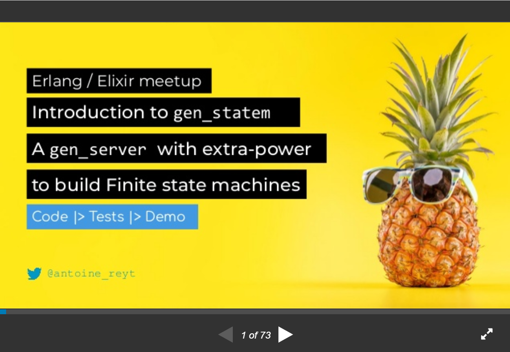
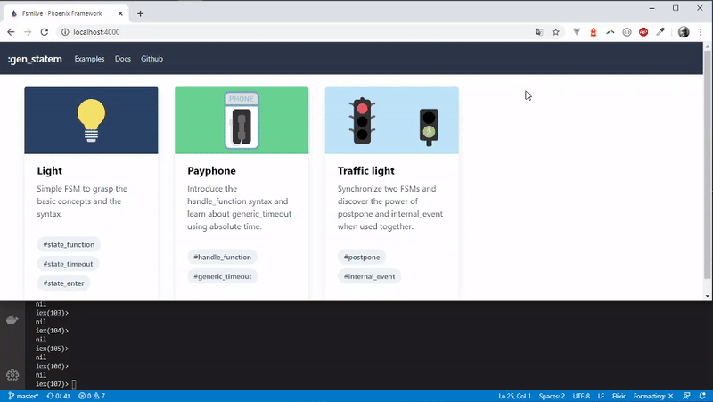
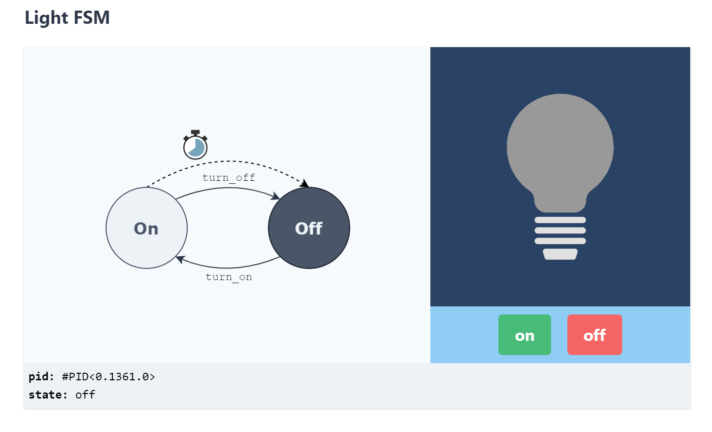
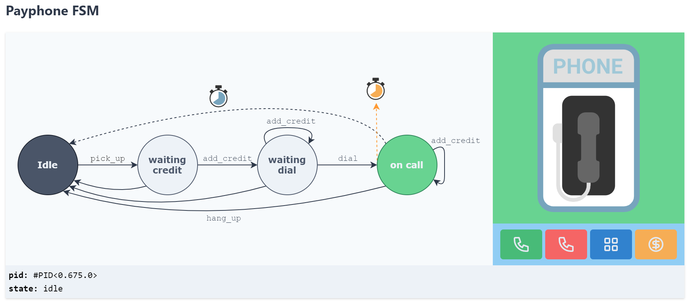
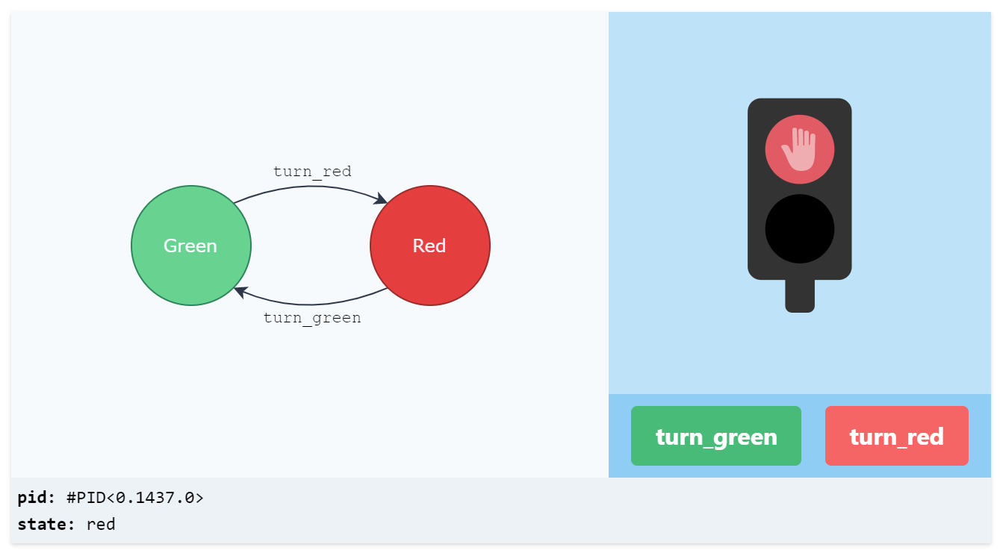
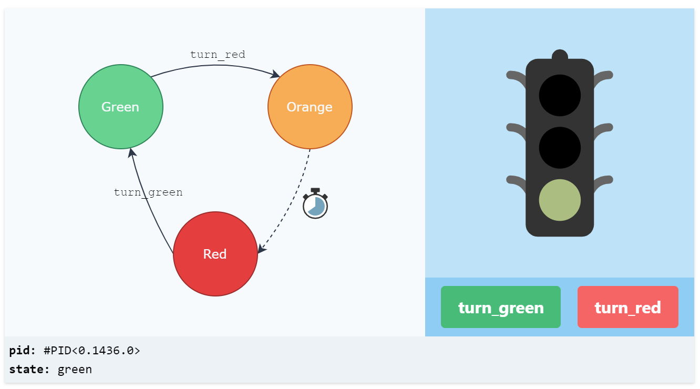
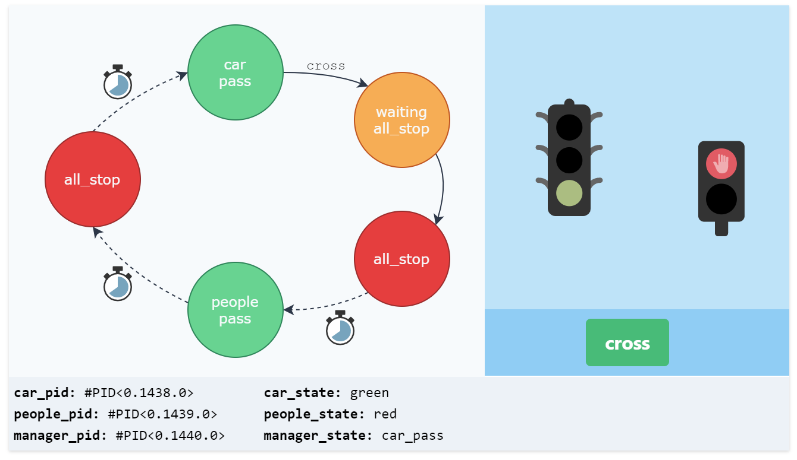

# Discover finite state machine with gen_statem

This repo is related to the Erlang/ Elixir meetup on 05/05/2020.

:pray: Organized by https://erlang-connection.eu | twitter: [@ErlangConnect](https://twitter.com/ErlangConnect)

:tv: You can find the  slides [here](https://www.slideshare.net/AntoineReyt/discover-finite-state-machines-with-genstatem-in-erlang-elixir) :point_down:.

# Code, tests, and boilerplate

This repo contains the code, the tests and the Liveview demo app shown during the meetup.

There is also some **reusable boilerplate** (code & tests) to start playing with gen_statem.

The boilerplates, lives in `lib/fsm/door` with their related tests in `test/fsm/door`.

# Demos

To start your Phoenix server:

  * Setup the project with `mix setup`
  * Start Phoenix endpoint with `mix phx.server`

Now you can visit [`localhost:4000`](http://localhost:4000) from your browser.

## Demo 1: Light

code: [lib/fsm/light/light_fsm.ex](lib/fsm/light/light_fsm.ex) | tests: [test/fsm/light/light_fsm_test.exs](test/fsm/light/light_fsm_test.exs)

### Rules

* Light is turned off by default
* When the "on" button is pressed, light is turned on
* When the "off" button is pressed, light is turned off
* After a given time, the light turns off itself

### You will learn:

* how to write your first finite state machine using the simple `state_function` syntax
* the `state_timeout` feature: after a given time in state X, do something
* the `state_enter` feature: do something anytime the current state changes
* how to write tests for your FSM

## Demo 2: Payphone

code: [lib/fsm/payphone/payphone_fsm.ex](lib/fsm/payphone/payphone_fsm.ex) | tests: [test/fsm/payphone/payphone_fsm_test.exs](test/fsm/payphone/payphone_fsm_test.exs)

### Sequence:

* pick up the phone
* add some credit
* dial a number
* speak
* hang up the phone

### Rules

* User can add credit when both dialing and calling.
* User can hang up at any time.
* When user runs out of credit, the phone hangs up itself.
* When the credit is low, the user gets a voice notification

### You will learn:

* the _other_ syntax: `handle_event_function` which can be more flexible
* the `generic_timeout` feature
* how to use absolute time for timeouts

## Demo 3: Traffic lights

code: [lib/fsm/traffic_light/traffic_light_manager_fsm.ex](lib/fsm/traffic_light/traffic_light_manager_fsm.ex) | tests: [test/fsm/traffic_light/traffic_light_manager_fsm_test.exs](test/fsm/traffic_light/traffic_light_manager_fsm_test.exs)

### Architecture

* PeopleFsm: the FSM for the people's traffic light
* CarFsm: the FSM for the car's traffic light
* ManagerFsm: the FSM that **orchestrate** the two others in order to achieve your goal

TrafficLight.PeopleFsm:

TrafficLight.CarFsm:

TrafficLight.ManagerFsm (the one that manage the two others):

### Goal:
Crossing the road.

### Sequence:

* By default, the traffic lights let the cars pass.
* Occasionally, people ask to cross the road using a button.
* Traffic light color changes to let the people pass.
* After a given time, traffic lights let the cars pass again

### You will learn:

* how to **decompose** your domain in several FSMs
* how to **coordinate** those FSMs with ... another FSMs :-)
* the `postpone` feature
* the `internal_event` feature
